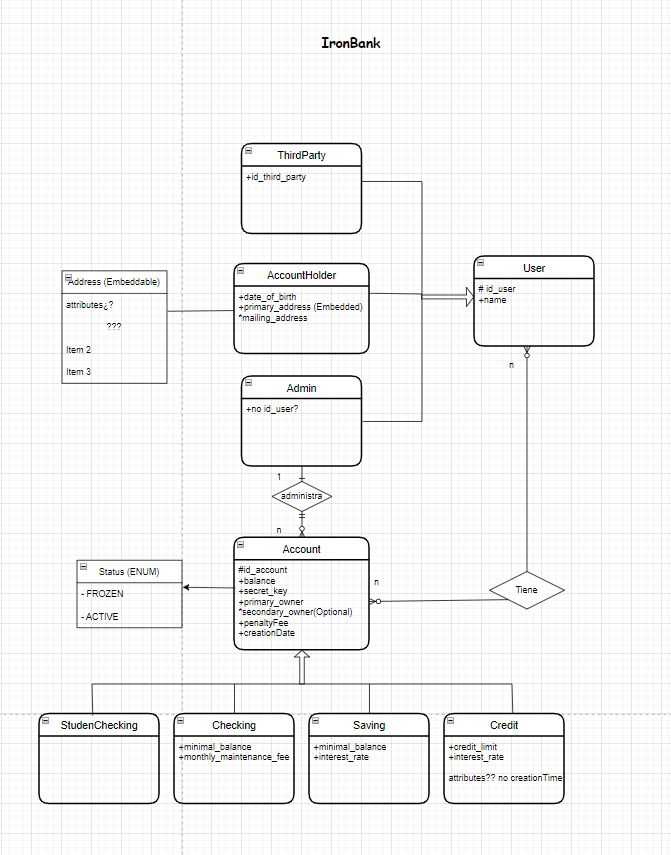

The IronBank - Final project

Week 12 (FINAL PROJECT)

Day 3 (Unit 5)

    The IronBank - Final project

The IronBank - Final project
PROJECT
The IronBank - Final Project

iron bank

The IronBank final projects are to be completed individually. You may not collaborate with classmates on this assignment. Should you need assistance, you should reach out to your instructional staff.

This project is designed to be challenging and should be completed as thoroughly as possible.

In this project, you will be building a banking system. You should meet all of the requirements below:
Requirements

The system must have 4 types of accounts: StudentChecking, Checking, Savings, and Credit Account.

Checking

Checking Accounts should have:

    A balance
    A secretKey
    A PrimaryOwner
    An optional SecondaryOwner
    A minimumBalance
    A penaltyFee
    A monthlyMaintenanceFee
    A creationDate
    A status (FROZEN, ACTIVE)

StudentChecking

Student Checking Accounts are identical to Checking Accounts except that they do NOT have:

    A monthlyMaintenanceFee
    A minimumBalance

Savings

Savings are identical to Checking accounts except that they

    Do NOT have a monthlyMaintenanceFee
    Do have an interestRate

Credit Account

Credit Accounts have:

    A balance
    A PrimaryOwner
    An optional SecondaryOwner
    A creditLimit
    An interestRate
    A penaltyFee

The system must have 3 types of Users: Admins, AccountHolders and ThirdParty.

AccountHolders

The AccountHolders should be able to access their own accounts and only their accounts when passing the correct credentials using Basic Auth. AccountHolders have:

    A name
    Date of birth
    A primaryAddress (which should be a separate address class)
    An optional mailingAddress

Admins

Admins only have a name

ThirdParty

The ThirdParty Accounts have an id and a name.

ThirdParty users are to be considered like other banks or institutions.

Operations related to this special kind of user will have to point to an “hashed key ( of 24 characters alphanumeric)” that refers to the account number on the other institution. We really have no control on how the key is hashed and it’s not relevant for us.

Admins can create new accounts. When creating a new account they can create Checking, Savings, or Credit Accounts.

Savings

    Savings accounts have a default interest rate of 0.0025
    Savings accounts may be instantiated with an interest rate other than the default, with a maximum interest rate of 0.5
    Savings accounts should have a default minimumBalance of 1000
    Savings accounts may be instantiated with a minimum balance of less than 1000 but no lower than 100

Credit Account

    Credit Account accounts have a default creditLimit of 100
    Credit Account may be instantiated with a creditLimit higher than 100 but not higher than 100000
    Credit Account have a default interestRate of 0.2
    Credit Account may be instantiated with an interestRate less than 0.2 but not lower than 0.1

CheckingAccounts

    When creating a new Checking account, if the primaryOwner is less than 24, a StudentChecking account should be created otherwise a regular Checking Account should be created.
    Checking accounts should have a minimumBalance of 250 and a monthlyMaintenanceFee of 12

Interest and Fees should be applied appropriately

PenaltyFee

    The penaltyFee for all accounts (that have this attribute) should be 40.
    If any account drops below the minimumBalance, the penaltyFee should be deducted from the balance automatically

InterestRate

    Interest on savings accounts is added to the account annually at the rate of specified interestRate per year. That means that if I have 1000000 in a savings account with a 0.01 interest rate, 1% of 1 Million is added to my account after 1 year. When a savings account balance is accessed, you must determine if it has been 1 year or more since either the account was created or since interest was added to the account, and add the appropriate interest to the balance if necessary.
    Interest on credit accounts is added to the balance monthly. If you have a 12% interest rate (0.12) then 1% interest will be added to the account monthly. When the balance of a credit account is accessed, check to determine if it has been 1 month or more since the account was created or since interested was added, and if so, add the appropriate interest to the balance.

Account Access

Admins

    Admins should be able to access the balance for any account and to modify it.

AccountHolders

    AccountHolders should be able to access their own account balance
    Account holders should be able to transfer money from any of their accounts to any other account (regardless of owner). The transfer should only be processed if the account has sufficient funds. The user must provide the Primary or Secondary owner name and the id of the account that should receive the transfer.

Third-Party Users

    There must be a way for third-party users to receive and send money to other accounts.
    Third-party users must be added to the database by an admin.
    In order to be able to receive and send money, Third-Party Users must provide their hashed key. They also must provide the amount, the Account id and the account secret key.

Extra features (bonus)

Fraud Detection

The application must recognize patterns that indicate fraud and Freeze the account status when potential fraud is detected.

Patterns that indicate fraud include:

    Transactions made in 24 hours total to more than 150% of the customers highest daily total transactions in any other 24 hour period.
    More than 2 transactions occurring on a single account within a 1 second period.

A client to interact with the API.

    It can be a client based client, a Swing application, or something more elaborated like an MVC application or React/Angular app. 

Microservices Architecture

    The project can be builded with microservices architecture in mind. With a gateway and eureka server.

Cloud Deploy

    Deploy your project on the cloud so that it can be accessible from the web

Technical Requirements

    Include a Java/Spring Boot backend.
    Everything should be stored in MySQL database tables.
    Include at least 1 GET, POST, PUT/PATCH, and DELETE route.
    Include authentication with Spring Security.
    Include unit and integration tests.
    Include robust error handling.
    You must use the com.ironhack.ironbank_monolit.model.account.Money class for all currency and BigDecimal for any other decimal or large number math.

Deliverables

    A working REST API, built by you that runs on a local server.
    The URL of the GitHub repository for your app.
    A simplified class diagram representing your project structure should be added to the repo.
    Adequate and complete documentation in the README.md file.

Good luck and have fun!

###Initial Diagrams

###Class Diagram

